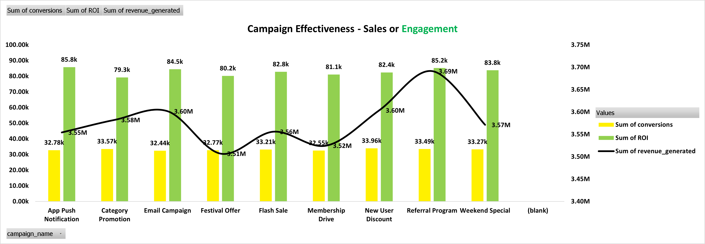

  

# Blinkit Dashboard Analysis

## Project Overview
This project is an interactive Excel dashboard analyzing Blinkit’s Sales,
Marketing, and Inventory data. The project uses pivot tables, pivot charts,
and slicers to uncover trends, evaluate campaign performance, and monitor
inventory efficiency for data-driven business decision-making.

## Dashboards Included
### Sales Dashboard
- Location-wise sales analysis
- Product category performance
- Monthly and quarterly trends

### Marketing Dashboard
- Campaign performance and ROI
- Conversion funnel analysis
- Channel-wise CPA

### Inventory Dashboard
- Stock levels and damaged stock
- Category-wise inventory trends
- Min vs max stock analysis

## Dashboard Preview

### Home

### Sales

### Marketing

### Inventory

## Tools Used
- Microsoft Excel
- Pivot Tables
- Pivot Charts
- Slicers
- Dashboard Design

## Author
Jyotirmaya Mishra
