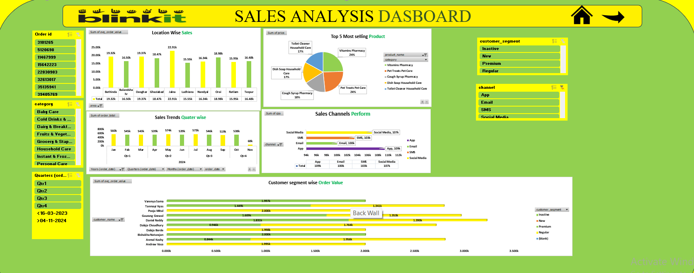
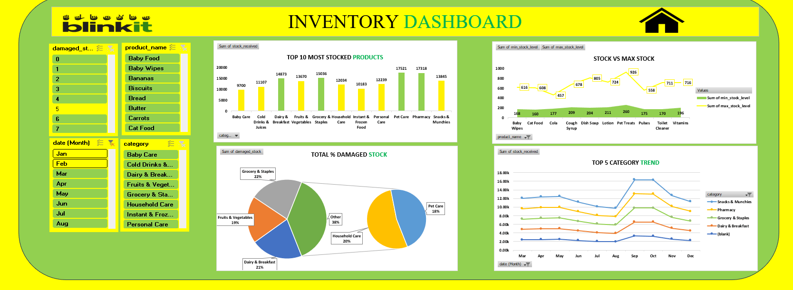

  

# Blinkit Dashboard Analysis

## Project Overview
This project is an interactive Excel-based dashboard created to analyze
Blinkit’s business performance across Sales, Marketing, and Inventory
functions. The goal of the project is to transform raw operational data
into meaningful insights that can support data-driven business decisions.

The analysis is performed using Microsoft Excel, leveraging pivot tables,
pivot charts, slicers, and structured dashboards. Multiple dashboards are
designed to provide a comprehensive view of sales trends, marketing campaign
effectiveness, and inventory health, all accessible through a navigation-
based home page.

## Business Problems Addressed

- Understanding sales performance across locations, products, and time periods
- Identifying high-performing and low-performing marketing campaigns
- Evaluating ROI, CPA, and conversion funnels across marketing channels
- Monitoring stock levels, damaged stock, and category-wise inventory trends
- Supporting better planning for sales growth and inventory optimization

  ## 🏠 Home Dashboard

- Central navigation hub enabling quick access to Sales, Marketing, and Inventory dashboards.
- Designed for a high-level overview and smooth dashboard-to-dashboard movement.

## 💰 Sales KPI Dashboard

Overview
The Sales KPI Dashboard delivers insights into revenue performance, customer behavior,
and sales channel effectiveness. It helps stakeholders track sales trends and identify
growth opportunities across regions and customer segments.

Key Insights

Provides location-wise sales analysis, highlighting high- and low-performing regions.

Identifies top-selling products and categories, enabling focused sales strategies.

Analyzes sales trends over time (monthly and quarterly) to detect seasonality
and growth patterns.

Evaluates sales channel performance across App, Email, SMS, and Social Media.

## 📢 Marketing KPI Dashboard

Overview
The Marketing KPI Dashboard evaluates the effectiveness of marketing campaigns
across multiple channels. It focuses on understanding customer engagement,
conversion behavior, and revenue contribution from different marketing strategies.

Key Insights

Measures campaign performance using key metrics such as conversions, ROI,
and revenue generated.

Compares effectiveness across multiple channels including App, Email,
SMS, and Social Media.

Identifies high-performing campaigns that drive maximum engagement and revenue.

Analyzes customer segments (New, Premium, Inactive) to understand which
audiences respond best to specific campaigns.

Supports optimization of marketing spend by linking cost, engagement,
and revenue outcomes.

## 📦 Inventory KPI Dashboard

Overview
The Inventory KPI Dashboard provides a comprehensive view of stock management across
products and categories. It is designed to help identify stock availability,
overstocking risks, and inventory inefficiencies that directly impact operations
and customer satisfaction.

Key Insights

Highlights the top 10 most stocked products, enabling better demand forecasting
and procurement planning.

Compares minimum vs maximum stock levels to quickly identify understocked
and overstocked items.

Analyzes damaged stock percentage by category, helping reduce wastage and
improve inventory handling efficiency.

Tracks category-wise inventory trends over time, supporting data-driven
inventory optimization decisions.

## Dashboards Included

### Home Dashboard
- Central navigation to access Sales, Marketing, and Inventory dashboards

### Sales Analysis Dashboard
- Location-wise and category-wise sales performance
- Monthly and quarterly sales trends
- Channel-wise sales contribution
- Customer segment analysis based on order value

### Marketing Analysis Dashboard
- Campaign effectiveness and engagement analysis
- ROI, revenue generated, and CPA metrics
- Marketing funnel analysis (Impressions → Clicks → Conversions)
- Channel-wise and customer segment performance

### Inventory Dashboard
- Top stocked products and category distribution
- Min stock vs max stock comparison
- Damaged stock percentage analysis
- Category-wise inventory trends over time

## Dashboard Preview

---
## 📊 Sales Dashboard

- Identifies location-wise sales performance, highlighting top and low-performing regions.
- Reveals product and category trends to support revenue growth and sales optimization.

---

## 📢 Marketing Dashboard

- Evaluates campaign effectiveness using conversions, ROI, and revenue generated.
- Highlights high-performing marketing channels and customer engagement patterns.

---

## 📦 Inventory Dashboard

- Compares minimum vs maximum stock levels to identify overstock and stockout risks.
- Tracks damaged stock and category-wise inventory trends to improve inventory planning.

## Tools & Skills Used

- Microsoft Excel
- Data Cleaning & Preparation
- Pivot Tables
- Pivot Charts
- Slicers & Filters
- Dashboard Design
- Business Data Analysis
## Key Learnings

- Designed end-to-end Excel dashboards for real-world business scenarios
- Improved ability to analyze data across multiple business functions
- Learned to translate data into actionable business insights
- Enhanced skills in Excel-based visualization and storytelling

## Author
Jyotirmaya Mishra
