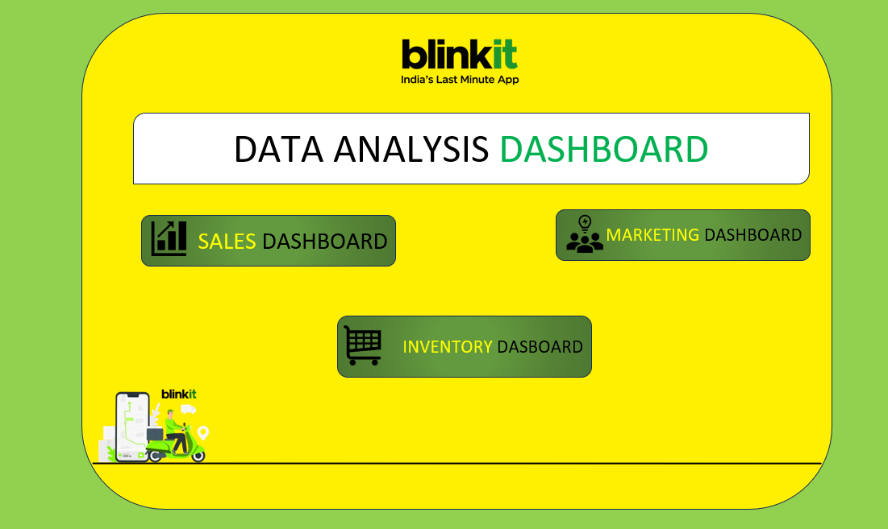
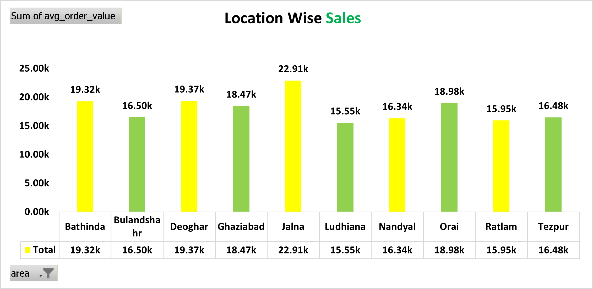
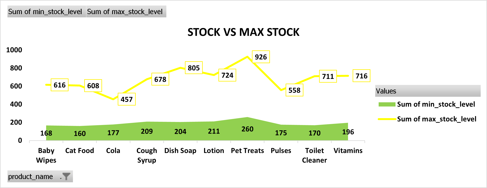

  

# Blinkit Dashboard Analysis

## Project Overview
This project is an interactive Excel-based dashboard created to analyze
Blinkit’s business performance across Sales, Marketing, and Inventory
functions. The goal of the project is to transform raw operational data
into meaningful insights that can support data-driven business decisions.

The analysis is performed using Microsoft Excel, leveraging pivot tables,
pivot charts, slicers, and structured dashboards. Multiple dashboards are
designed to provide a comprehensive view of sales trends, marketing campaign
effectiveness, and inventory health, all accessible through a navigation-
based home page.

## Business Problems Addressed

- Understanding sales performance across locations, products, and time periods
- Identifying high-performing and low-performing marketing campaigns
- Evaluating ROI, CPA, and conversion funnels across marketing channels
- Monitoring stock levels, damaged stock, and category-wise inventory trends
- Supporting better planning for sales growth and inventory optimization
## Dashboards Included

### Home Dashboard
- Central navigation to access Sales, Marketing, and Inventory dashboards

### Sales Analysis Dashboard
- Location-wise and category-wise sales performance
- Monthly and quarterly sales trends
- Channel-wise sales contribution
- Customer segment analysis based on order value

### Marketing Analysis Dashboard
- Campaign effectiveness and engagement analysis
- ROI, revenue generated, and CPA metrics
- Marketing funnel analysis (Impressions → Clicks → Conversions)
- Channel-wise and customer segment performance

### Inventory Dashboard
- Top stocked products and category distribution
- Min stock vs max stock comparison
- Damaged stock percentage analysis
- Category-wise inventory trends over time

## Dashboard Preview

### Home

### Sales

### Marketing

### Inventory

## Tools & Skills Used

- Microsoft Excel
- Data Cleaning & Preparation
- Pivot Tables
- Pivot Charts
- Slicers & Filters
- Dashboard Design
- Business Data Analysis
## Key Learnings

- Designed end-to-end Excel dashboards for real-world business scenarios
- Improved ability to analyze data across multiple business functions
- Learned to translate data into actionable business insights
- Enhanced skills in Excel-based visualization and storytelling

## Author
Jyotirmaya Mishra
